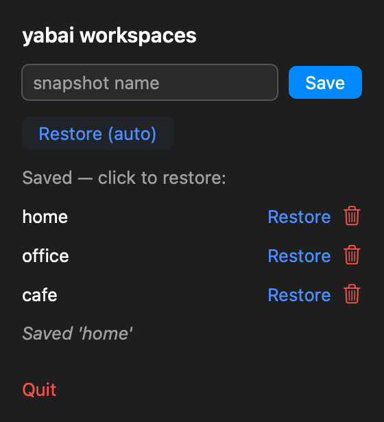
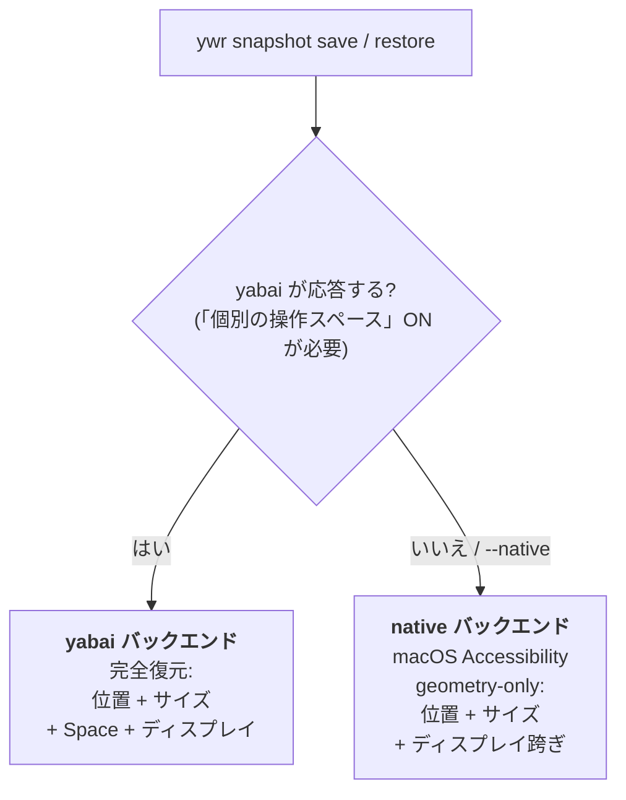
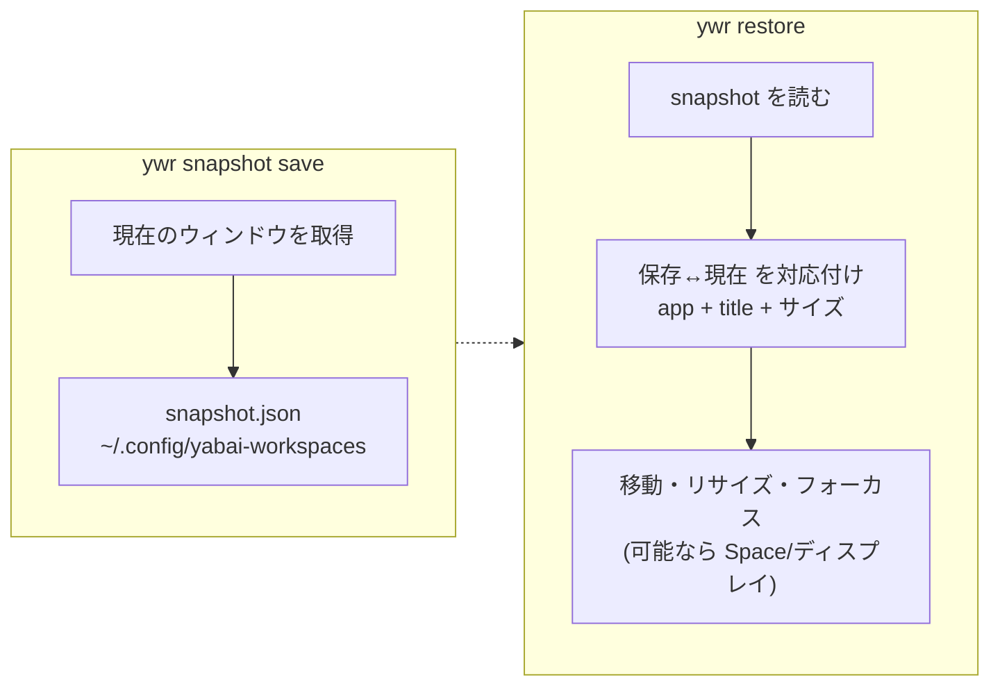
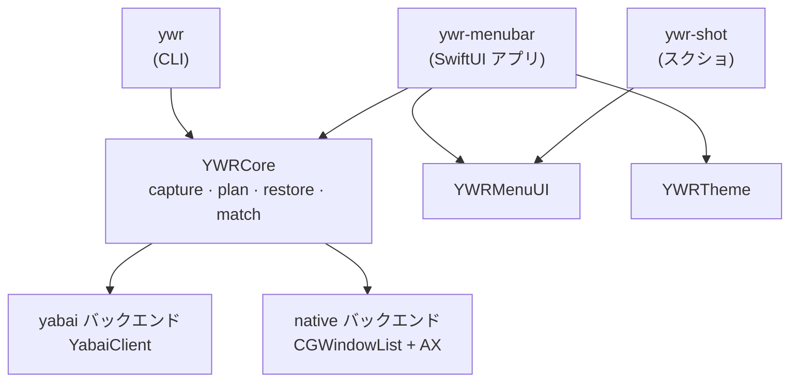

# ywr — yabai workspaces

[English](README.md) | 日本語

**macOS のウィンドウ配置を保存して、コマンド一つで元に戻す** — ディスプレイや
仮想デスクトップをまたいでも。[yabai](https://github.com/koekeishiya/yabai) があれば
Space/ディスプレイまで完全復元し、yabai が動かない環境では**内蔵の yabai 非依存
バックエンド**に自動で切り替わります。

<p align="center">
  
</p>

---

## 何を解決するか

マルチモニタ環境では、ドッキングや抜き差し・構成変更のたびにウィンドウ配置が
崩れます。`ywr` は「どこに何があったか」を保存し、**位置・サイズ・各ウィンドウの
Space/ディスプレイ・最前面だったウィンドウ**まで元に戻します。

## 仕組み

`ywr` は環境に応じてバックエンドを自動選択します。



- **yabai バックエンド** — フル機能。Space やディスプレイへの移動も行います。yabai の
  起動（＝「ディスプレイごとに個別の操作スペース」ON が必須）と、Space 跨ぎには
  scripting-addition が必要です。
- **native バックエンド** — yabai 不要。macOS の Accessibility でウィンドウの位置・
  サイズ（**別モニタへの移動も含む**）と最前面ウィンドウを復元します。yabai が起動
  できない「スペースをまたぐ（spanning）」構成でも動くのはこのおかげです。

## クイックスタート

```sh
# 1.（任意）Space/ディスプレイまで完全復元したいなら yabai を導入。Space 跨ぎには
#    scripting-addition も必要（yabai wiki 参照）。yabai 無しでも native バックエンドで
#    位置・サイズ＋ディスプレイは復元できます（Space 移動は不可）。
brew install koekeishiya/formulae/yabai && yabai --start-service

# 2. ywr をビルドして PATH に配置
swift build -c release && mkdir -p ~/.local/bin && cp .build/release/ywr ~/.local/bin/ywr

# 3. 環境チェック（どのバックエンドが有効かを表示）
ywr doctor

# 4. 現在の配置を保存し、あとで復元
ywr snapshot save home
ywr restore home            # まず確認: ywr restore home --dry-run
```

権限はバックエンドで異なります。**native バックエンド**は `ywr` を動かすプロセス
（ターミナル等）に **Accessibility 権限**が必要。**yabai バックエンド**は代わりに
**yabai 自身**に Accessibility（＋ Space 跨ぎには scripting-addition）が必要です
（`ywr` は `yabai -m` を呼ぶだけ）。

## 復元の流れ



復元は保存済みの各ウィンドウを現在のウィンドウに対応付けて再配置します。置けなかった
ウィンドウは最後に一覧表示され、**黙って失敗することはありません**。

## バックエンド比較

| できること | yabai | native |
|---|:---:|:---:|
| ウィンドウの位置・サイズ | ✅ | ✅ |
| ディスプレイ跨ぎの移動 | ✅ | ✅ |
| 最前面ウィンドウの復元 | ✅ | ✅ |
| 保存した **Space** へ移動 | ✅ | ❌ |
| 「個別スペース」OFF でも動く | ❌（yabai が起動不可） | ✅ |
| 追加要件 | yabai + scripting-addition | Accessibility（+ 画面収録推奨） |

`--native` を付ければいつでも native を強制できます
（例: `ywr restore home --native`）。

## 自動復元

ディスプレイ構成が変わったら自動で復元 — 好みの方式を選べます。
**これらは yabai バックエンド専用**です（yabai のディスプレイ情報/イベントを使うため、
yabai 無しの native 構成では使えません）:

```sh
ywr restore --auto        # 現在の構成に一致する snapshot を自動選択
ywr daemon                # ディスプレイ変更を監視して自動復元（ポーリング）
ywr signal install        # yabai のイベントで復元を発火（デーモン不要）
```

yabai 無しの場合は、名前を指定して復元してください: `ywr restore home --native`。

## メニューバーアプリ

`ywr-menubar` は CLI と同じ操作を SwiftUI のメニューバーで提供します。名前を入力して
保存、保存済みをクリックして復元、🗑 ボタンで削除（確認あり）、または
**Restore (auto)**。配色・フォントは外部の `theme.json` で指定します。

```sh
swift run ywr-menubar
```

**アイコンが表示されない**場合は、`.app` バンドルとして起動してください（macOS は
バンドル化した常駐アプリのメニューバー項目を確実に表示します）:

```sh
bash scripts/make-menubar-app.sh && open build/YabaiWorkspaces.app
```

> CLI と同様に、メニューバーアプリも yabai 未起動時は **native バックエンド**へ自動
> フォールバックします（保存・クリック復元は動作。**Restore (auto)** は yabai が必要）。

## ドキュメント

- **[使い方ガイド](docs/usage.ja.md)** — 全コマンド・native バックエンド・テーマ・トラブルシュート（[English](docs/usage.md)）
- **[ロードマップ](ROADMAP.md)** · **[PRD](PRD.md)**

## アーキテクチャ

テスト可能なコア（`YWRCore`）＋薄い実行ファイル群。副作用（yabai・Accessibility・
ファイルシステム）はすべてプロトコル境界の背後にあり、コア全体を in-memory フェイクで
単体テストしています。



```sh
swift build                # ywr バイナリをビルド
swift test                 # 単体テスト（XCTest; Xcode 必要）
bash Tests/e2e/run.sh      # e2e: 実バイナリ vs 偽 yabai
bash scripts/report.sh     # → build/report/report.html（結果 + UI スクショ）
```

## ライセンス

MIT — [LICENSE](LICENSE) 参照。yabai は別の MIT ライセンスプロジェクトで、ywr は
yabai のバイナリやソースを含みません。
