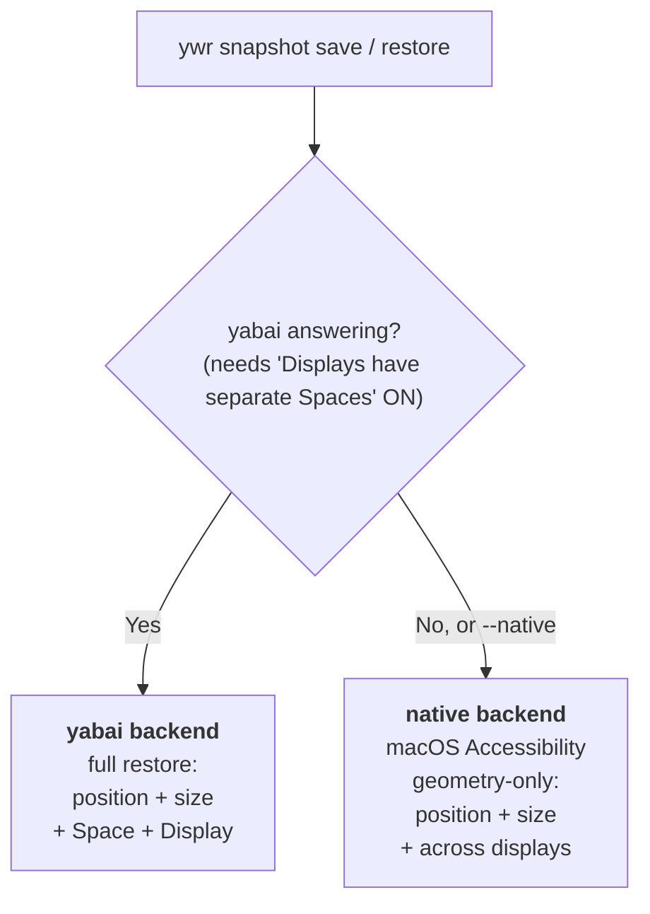
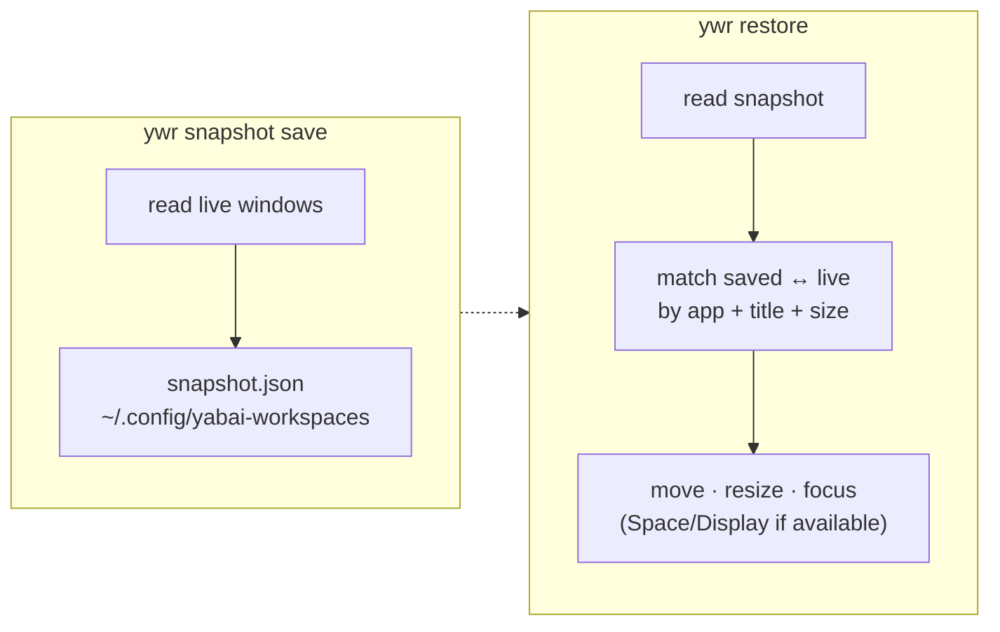
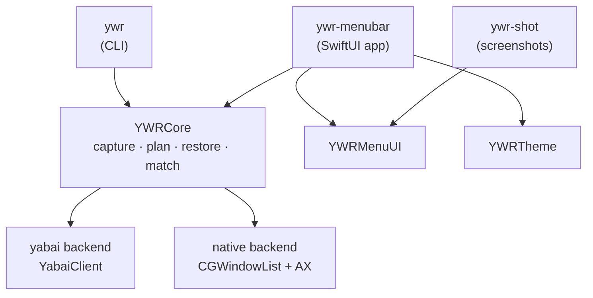

# ywr — yabai workspaces

English | [日本語](README.ja.md)

**Save your macOS window layout and put it back with one command** — across
displays and virtual desktops. Works with [yabai](https://github.com/koekeishiya/yabai)
for full Space/Display restore, and falls back to a built-in, yabai-independent
backend when yabai can't run.

<p align="center">
  
</p>

---

## Why

Multi-monitor setups scramble your windows every time you dock, undock, or
change displays. `ywr` captures where everything is and restores it — window
positions, sizes, the Space/Display each window lives on, and which window was
frontmost.

## How it works

`ywr` picks a backend automatically based on your setup:



- **yabai backend** — the full experience: also moves windows to the right
  Space and Display. Needs yabai running (which requires *Displays have separate
  Spaces* = ON) plus the scripting-addition for cross-Space moves.
- **native backend** — no yabai required. Restores window position/size
  (including moving across monitors) and the frontmost window, using the macOS
  Accessibility API. This is what makes ywr work in the "spanning desktop"
  configuration where yabai refuses to start.

## Install

**Menu-bar app** — grab `YabaiWorkspaces.app` from the
[Releases](https://github.com/tomo235789/yabai-workspaces/releases) page (signed
& notarized), move it to `/Applications`, open it, and grant **Accessibility**
when asked. That's the whole setup for the GUI.

**CLI (`ywr`)** — build from source (a Homebrew formula is planned):

```sh
swift build -c release && mkdir -p ~/.local/bin && cp .build/release/ywr ~/.local/bin/ywr
ywr doctor          # shows which backend is active
```

**Optional — yabai** for full Space/Display restore (without it, ywr uses the
native backend: position/size + display, no Space moves):

```sh
brew install koekeishiya/formulae/yabai && yabai --start-service
```

Then save and restore:

```sh
ywr snapshot save home
ywr restore home            # preview first with: ywr restore home --dry-run
```

> Building the app yourself instead? See the
> [usage guide](docs/usage.md) — `scripts/make-menubar-app.sh` bundles it, and
> `scripts/create-signing-cert.sh` keeps the Accessibility grant across rebuilds.

Permissions differ by backend: the **native backend** needs **Accessibility**
granted to whatever runs `ywr` (Terminal or the app); the **yabai backend**
instead needs **yabai itself** to have Accessibility, plus its scripting-addition
for cross-Space moves — `ywr` only shells out to `yabai -m`. ywr collects no data
and makes no network requests — see [PRIVACY.md](PRIVACY.md).

## What restore does



Restore matches each saved window to a live one, then repositions it. Windows
it can't place are listed at the end — nothing fails silently.

## Backends at a glance

| Capability | yabai backend | native backend |
|---|:---:|:---:|
| Window position & size | ✅ | ✅ |
| Move across displays | ✅ | ✅ |
| Restore frontmost window | ✅ | ✅ |
| Move to the saved **Space** | ✅ | ❌ |
| Works with *separate Spaces* OFF | ❌ (yabai won't run) | ✅ |
| Extra requirement | yabai + scripting-addition | Accessibility (+ Screen Recording helps) |

Force the native backend anytime with `--native`
(e.g. `ywr restore home --native`).

## Menu-bar app

`ywr-menubar` mirrors the CLI in a SwiftUI menu-bar popover: type a name to
save, **click a saved layout** to restore it (in native mode, on the current
desktop), use its **▦ button** to restore across **all desktops** (walks Spaces —
see below), re-save it in place with 🔄, or delete one with 🗑 (with a
confirmation). Colors and fonts come from an external `theme.json`.

```sh
swift run ywr-menubar
```

If the menu-bar **icon doesn't appear**, run it as a bundled app (macOS shows the
menu-bar item for a bundled accessory app):

```sh
bash scripts/make-menubar-app.sh && open build/YabaiWorkspaces.app
```

**Start it automatically at login** — installs to `~/Applications` and registers
a LaunchAgent (rerun to refresh after a rebuild):

```sh
bash scripts/autostart-install.sh     # install + start now + start at login
bash scripts/autostart-uninstall.sh   # disable auto-start
```

> Like the CLI, the menu-bar app falls back to the **native backend** when yabai
> isn't running (save and click-to-restore work).

## Documentation

- **[Usage guide](docs/usage.md)** — every command, the native backend, theming, troubleshooting ([日本語](docs/usage.ja.md))
- **[Privacy](PRIVACY.md)** · **[Changelog](CHANGELOG.md)** · **[Roadmap](ROADMAP.md)** · **[PRD](PRD.md)**

## Architecture

A testable core (`YWRCore`) with thin executables around it. Every side effect
(yabai, Accessibility, the filesystem) sits behind a protocol, so the whole core
is unit-tested with in-memory fakes.



```sh
swift build                # build the ywr binary
swift test                 # unit tests (XCTest; needs Xcode)
bash Tests/e2e/run.sh      # end-to-end: real binary vs. a fake yabai
bash scripts/report.sh     # → build/report/report.html (results + UI screenshots)
swift package plugin --allow-writing-to-package-directory swiftformat  # format code
```

## License

MIT — see [LICENSE](LICENSE). yabai is a separate MIT-licensed project; ywr does
not include yabai binaries or source.
